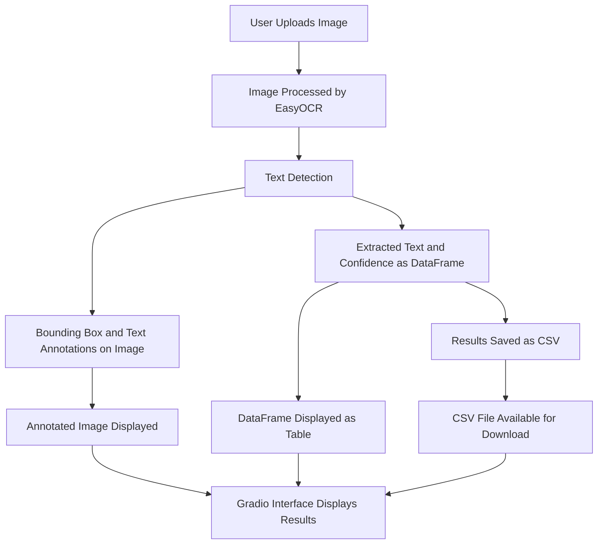

# text_ocr_detetction
This repo contains gradio app for detecting text using OCR


### Mermaid Workflow Diagram



---

### README for the Code

#### **Text Detection with EasyOCR**

This project demonstrates a simple pipeline for detecting text in images using EasyOCR, OpenCV, and Gradio. The application allows users to upload an image, detects text in the image, and provides an annotated output with bounding boxes and confidence levels.

---

#### **Features**
1. **Text Detection**:
   - Utilizes EasyOCR for recognizing text in English.
   - Outputs detected text and its confidence level.

2. **Annotated Image**:
   - Draws bounding boxes around detected text regions.
   - Annotates detected text above each bounding box.

3. **DataFrame Output**:
   - Detected text and confidence levels are displayed in a tabular format.

4. **CSV Download**:
   - Results are saved in a downloadable CSV file for further analysis.

5. **Gradio Integration**:
   - Provides an interactive UI for uploading images, viewing outputs, and downloading results.

---

#### **How It Works**
1. **Upload an Image**:
   - The user uploads an image via the Gradio interface.

2. **Process Image**:
   - The image is converted to RGB using OpenCV.
   - EasyOCR reads the image to detect text regions and confidence levels.
   - Bounding boxes and text annotations are drawn on the image.

3. **Display Results**:
   - Annotated image is displayed alongside a table of text and confidence levels.
   - Users can download the results as a CSV file.

4. **Download CSV**:
   - The detected text and confidence levels are saved to a CSV file, which is made available for download.

---

#### **Dependencies**
Ensure the following Python libraries are installed:
- `opencv-python`: Image processing.
- `easyocr`: Optical character recognition.
- `gradio`: Building the interactive user interface.
- `pandas`: Handling tabular data.
- `numpy`: Numerical operations.

Install them with:
```bash
pip install opencv-python easyocr gradio pandas numpy
```

---

#### **Running the Application**
1. Save the code to a Python file, e.g., `text_detection.py`.
2. Run the application:
   ```bash
   python text_detection.py
   ```
3. Access the Gradio interface in your browser via the provided URL.

---

#### **File Structure**
- **Input**: Upload an image for text detection.
- **Output**:
  - Annotated image with bounding boxes and detected text.
  - Table showing detected text and confidence levels.
  - Downloadable CSV file of the results.

---

#### **Customization**
- **Language Support**: Add other languages supported by EasyOCR by updating:
  ```python
  reader = easyocr.Reader(['en'], gpu=False)
  ```
- **GPU Acceleration**: Enable GPU acceleration for faster processing by setting `gpu=True` in the EasyOCR reader.

---

Feel free to expand this project by incorporating additional features such as multiple language support or batch processing of images!
